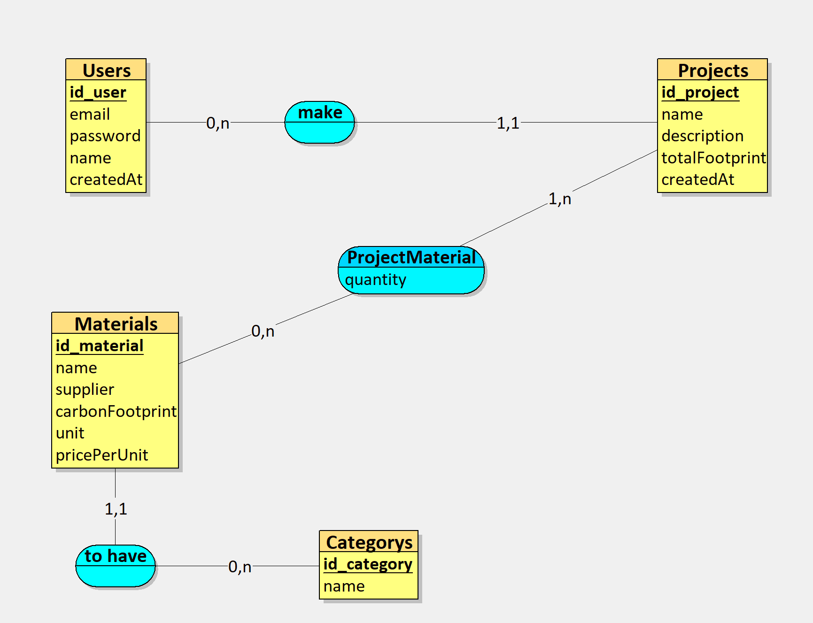
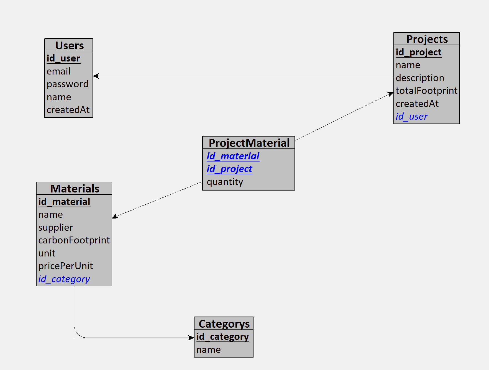
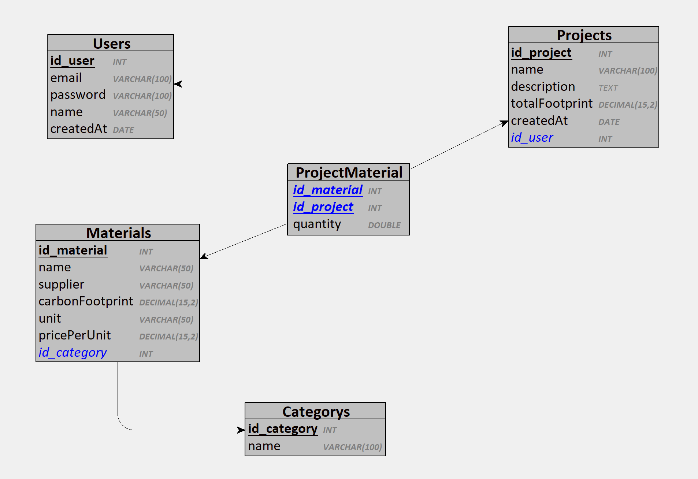

# CarbonTrack - Application de Calcul de l'Empreinte Carbone des Matériaux de Construction

## Présentation
CarbonTrack est une application innovante destinée à aider les professionnels du bâtiment à calculer, suivre et réduire l'empreinte carbone des matériaux utilisés dans leurs projets de construction. Elle permet une gestion efficace des projets tout en favorisant des pratiques de construction durables.

## Fonctionnalités Principales
- **Base de données des matériaux** : Informations sur l'empreinte carbone des différents matériaux de construction.
- **Calculateur de projet** : Interface pour sélectionner les matériaux et calculer l'empreinte carbone totale d'un projet.
- **Rapports et recommandations** : Génération de rapports détaillés et suggestions d'alternatives plus durables.

## Pages de l'Application
- **Page d'accueil** : Présentation de l'application et de ses fonctionnalités. Liens vers les différentes sections.
- **Page de connexion et d'inscription** : Formulaires pour les utilisateurs existants et nouveaux.
- **Tableau de bord utilisateur** : Vue d'ensemble des projets, accès rapide aux projets récents et recommandations.
- **Page de gestion des matériaux** : Liste des matériaux, formulaire pour leur gestion, détails incluant l'empreinte carbone.
- **Page de création et de gestion de projet** : Formulaire de création de projet, sélection des matériaux, calcul de l'empreinte carbone.
- **Page de visualisation des rapports** : Rapports détaillés, graphiques, visualisations des données, suggestions d'alternatives.
- **Page de profil utilisateur** : Informations personnelles, paramètres et préférences.

## Architecture Technique
### Backend (Node.js, Express, Prisma)
- **Configuration du serveur** : API REST avec Express.
- **Routes et contrôleurs** :
  - Authentification : Inscription, connexion, déconnexion.
  - Gestion des matériaux : CRUD pour les matériaux.
  - Gestion des projets : CRUD, calcul de l'empreinte carbone.

### Frontend (Vue.js)
- **Configuration du projet** : Création avec Vue CLI.
- **Composants UI** : Composants réutilisables pour l'interface (formulaires, tableau de bord).
- **Services API** : Interaction avec l'API backend.
- **Gestion de l'état** : Utilisation de Vuex.
- **Routes frontend** : Navigation avec Vue Router.

## Points à Développer
- **Gestion des utilisateurs** : Authentification avec JWT (Auth0 à voir).
- **Gestion des matériaux** : CRUD complet avec validation des données.
- **Gestion des projets** : CRUD complet, calcul de l'empreinte carbone basé sur les matériaux.
- **UI/UX** : Design intuitif et convivial.
- **Sécurité** : Protection des données des utilisateurs.

## Modèle Conceptuel de Données (MCD)

## Modèle Logique de Données (MLD)

## Modèle Physique de Données (MPD)

