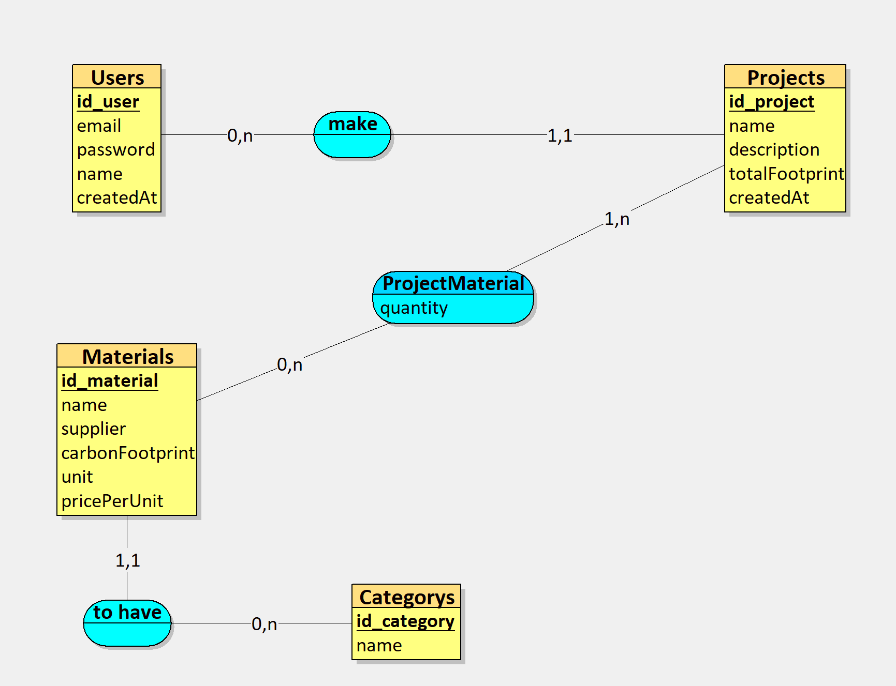
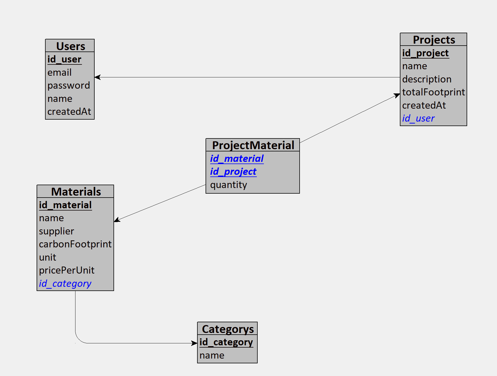
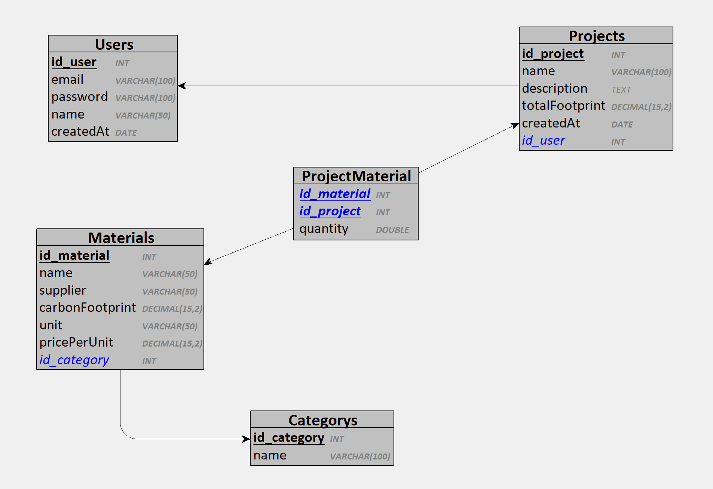

# Modèle de données (Merise)

Merise est une méthode d'analyse et de conception des systèmes d'information,
fondée sur la séparation des données et des traitements. Elle décrit les
données à trois niveaux d'abstraction, du métier vers la base réelle.

Les trois modèles sont dessinés avec [Looping](https://www.looping-mcd.fr/) ;
la source éditable est `Methode-Merise.loo`, à côté de ce fichier. Les images
ci-dessous en sont l'export : les regénérer après toute modification du `.loo`.

Leur traduction exécutable est `apps/api/prisma/schema.prisma`, dont les
migrations sont versionnées dans `apps/api/prisma/migrations/`.

## Modèle Conceptuel de Données (MCD)

Les entités du métier et leurs associations, sans préjuger de la technique.

## Modèle Logique de Données (MLD)

Le MCD traduit en relations : les associations deviennent des clés étrangères
ou des tables de jointure.

## Modèle Physique de Données (MPD)

Le MLD tel qu'il existe dans PostgreSQL : types, longueurs, contraintes.

